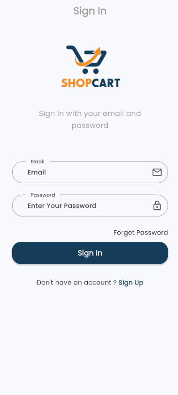
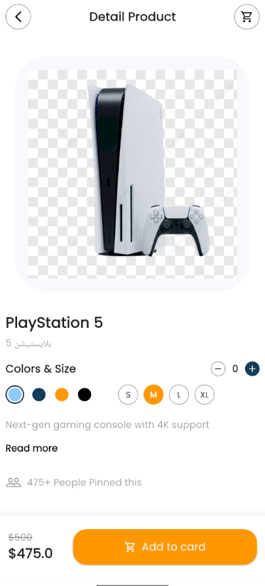
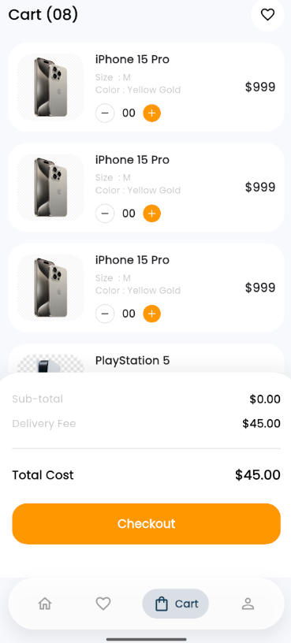

<div align="center">

# 🛍️ Flutter E-Commerce & Delivery App

### A Modern, Full-Featured E-Commerce Application Built with Flutter

[](https://flutter.dev)
[](https://dart.dev)
[](https://firebase.google.com)
[](https://pub.dev/packages/get)
[](LICENSE)

[English](#english) | [العربية](#arabic)

</div>

---

## <a name="english"></a>🌟 **Overview**

A comprehensive Flutter e-commerce application featuring real-time order tracking, integrated payment systems, Firebase authentication, and a beautiful, responsive UI with support for both Arabic and English languages.

---

## ✨ **Key Features**

### 🔐 **Authentication & Security**
- Firebase Authentication (Email/Password & Google Sign-In)
- Secure user session management
- OTP verification system
- Password recovery functionality

### 🛒 **E-Commerce Core**
- Product catalog with categories
- Advanced product search and filtering
- Shopping cart management
- Order placement and tracking
- Order history with detailed views
- Favorites/Wishlist functionality

### 📍 **Location & Delivery**
- Google Maps integration
- Real-time location tracking
- Address geocoding and reverse geocoding
- Multiple delivery address management
- Interactive map for address selection
- Real-time delivery tracking with polylines

### 💬 **Communication**
- In-app chat system
- Real-time Firebase Cloud Messaging (FCM)
- Push notifications for orders
- Chat support with sellers/admin

### 🎨 **UI/UX Excellence**
- Modern Material Design
- Smooth animations with Lottie
- Custom splash screen
- Responsive layouts for all screen sizes
- Dark/Light theme support (planned)
- Arabic (RTL) and English (LTR) localization

### 🔧 **Technical Features**
- GetX State Management
- Local data caching with Sqflite
- Image caching for better performance
- QR code generation and scanning
- Deep linking support
- Offline mode capabilities

---

## 📸 **Screenshots**

<div align="center">

### Splash & Authentication

| Splash Screen | Login Screen |
|:---:|:---:|
|  |  |

### Main Features

| Home Screen | Product Details | Shopping Cart |
|:---:|:---:|:---:|
|  |  |  |

</div>

---

## 🛠️ **Tech Stack**

### **Core Framework**
- **[Flutter 3.9.2](https://flutter.dev/)** - Cross-platform mobile development
- **[Dart 3.9.2](https://dart.dev/)** - Programming language

### **State Management & Architecture**
- **[GetX 4.7.2](https://pub.dev/packages/get)** - State management, dependency injection, routing

### **Backend & Cloud**
- **[Firebase Core](https://pub.dev/packages/firebase_core)** - Firebase initialization
- **[Cloud Firestore](https://pub.dev/packages/cloud_firestore)** - NoSQL database
- **[Firebase Messaging](https://pub.dev/packages/firebase_messaging)** - Push notifications
- **[Firebase Storage](https://pub.dev/packages/firebase_storage)** - File storage

### **Maps & Location**
- **[Google Maps Flutter](https://pub.dev/packages/google_maps_flutter)** - Interactive maps
- **[Geolocator](https://pub.dev/packages/geolocator)** - Location services
- **[Geocoding](https://pub.dev/packages/geocoding)** - Address conversion
- **[Flutter Polyline Points](https://pub.dev/packages/flutter_polyline_points)** - Route drawing

### **UI & Animations**
- **[Lottie](https://pub.dev/packages/lottie)** - Beautiful animations
- **[Show Up Animation](https://pub.dev/packages/show_up_animation)** - Reveal animations
- **[Cached Network Image](https://pub.dev/packages/cached_network_image)** - Image caching

### **Local Storage**
- **[Sqflite](https://pub.dev/packages/sqflite)** - Local database
- **[Shared Preferences](https://pub.dev/packages/shared_preferences)** - Key-value storage

### **Authentication**
- **[Google Sign In](https://pub.dev/packages/google_sign_in)** - Google authentication
- **[Flutter OTP Text Field](https://pub.dev/packages/flutter_otp_text_field)** - OTP input

### **Other Features**
- **[QR Flutter](https://pub.dev/packages/qr_flutter)** - QR code generation
- **[Mobile Scanner](https://pub.dev/packages/mobile_scanner)** - QR code scanning
- **[Image Picker](https://pub.dev/packages/image_picker)** - Camera & gallery access
- **[URL Launcher](https://pub.dev/packages/url_launcher)** - External links
- **[Badges](https://pub.dev/packages/badges)** - UI badges (cart counter)
- **[Grouped List](https://pub.dev/packages/grouped_list)** - Organized lists

---

## 🏁 **Getting Started**

### **Prerequisites**

Before you begin, ensure you have the following installed:

- **Flutter SDK** (3.9.2 or higher) - [Installation Guide](https://docs.flutter.dev/get-started/install)
- **Dart SDK** (3.9.2 or higher)
- **Android Studio** or **VS Code** with Flutter extensions
- **Git** for version control
- **Firebase Account** for backend services

### **Installation**

1. **Clone the repository**
   ```bash
   git clone https://github.com/balygh-tajalden/flutter-ecommerce.git
   cd flutter-ecommerce
   ```

2. **Install dependencies**
   ```bash
   flutter pub get
   ```

3. **Firebase Setup**
   
   - Create a new Firebase project at [Firebase Console](https://console.firebase.google.com/)
   - Add Android/iOS apps to your Firebase project
   - Download `google-services.json` (Android) and place it in `android/app/`
   - Download `GoogleService-Info.plist` (iOS) and place it in `ios/Runner/`
   - Enable Firebase Authentication (Email/Password & Google)
   - Create a Firestore database
   - Enable Firebase Cloud Messaging
   - Enable Firebase Storage

4. **Google Maps Setup**
   
   - Get a Google Maps API key from [Google Cloud Console](https://console.cloud.google.com/)
   - Enable **Maps SDK for Android** and **Maps SDK for iOS**
   - Add the API key:
     - **Android**: In `android/app/src/main/AndroidManifest.xml`
       ```xml
       <meta-data
           android:name="com.google.android.geo.API_KEY"
           android:value="YOUR_API_KEY_HERE"/>
       ```
     - **iOS**: In `ios/Runner/AppDelegate.swift`
       ```swift
       GMSServices.provideAPIKey("YOUR_API_KEY_HERE")
       ```

5. **Update API Endpoints**
   
   - Open `lib/linkapi.dart`
   - Update backend API URLs to match your server

6. **Run the app**
   ```bash
   # For debug mode
   flutter run
   
   # For release mode
   flutter run --release
   ```

---

## 📂 **Project Structure**

```
lib/
├── Bindings/              # GetX dependency injection bindings
├── controller/            # Business logic controllers (GetX)
│   ├── auth/             # Authentication controllers
│   ├── chat_controller.dart
│   ├── home_controller.dart
│   └── users_controller.dart
├── core/                  # Core utilities and constants
│   ├── class/            # Helper classes (CRUD, status handling)
│   ├── constant/         # App constants (colors, routes, images)
│   ├── functions/        # Utility functions
│   ├── localization/     # i18n translations
│   ├── middleware/       # Route guards
│   └── services/         # App services (storage, network)
├── data/                  # Data layer
│   ├── datasource/       # Remote and local data sources
│   └── model/            # Data models
├── view/                  # UI layer
│   ├── screen/           # App screens
│   └── widget/           # Reusable widgets
├── routes.dart            # App routing configuration
├── linkapi.dart           # API endpoints
└── main.dart              # App entry point

assets/
├── fonts/                 # Custom fonts (Pnu, Poppins)
├── icons/                 # App icons and logos
├── images/                # Static images
└── lottie/                # Lottie animation files

screenshots/               # App screenshots for documentation
```

---

## 🧪 **Testing**

```bash
# Run all tests
flutter test

# Run with coverage
flutter test --coverage

# Run specific test file
flutter test test/widget_test.dart
```

---

## 📦 **Building for Production**

### **Android APK**
```bash
flutter build apk --release
```

### **Android App Bundle (for Play Store)**
```bash
flutter build appbundle --release
```

### **iOS**
```bash
flutter build ios --release
```

---

## 🚀 **Deployment**

### **Android (Google Play Store)**
1. Generate a signed APK/App Bundle
2. Create a Google Play Developer account
3. Upload the App Bundle to Play Console
4. Complete the store listing
5. Submit for review

### **iOS (App Store)**
1. Build the app in Release mode
2. Archive the app in Xcode
3. Upload to App Store Connect
4. Complete the app metadata
5. Submit for review

---

## 🔮 **Roadmap**

- [ ] Payment gateway integration (Stripe, PayPal)
- [ ] Admin dashboard
- [ ] Seller/Vendor portal
- [ ] Product reviews and ratings
- [ ] Social media sharing
- [ ] Dark mode
- [ ] Multi-currency support
- [ ] Advanced analytics

---

## 🤝 **Contributing**

Contributions are welcome! Please feel free to submit a Pull Request.

1. Fork the Project
2. Create your Feature Branch (`git checkout -b feature/AmazingFeature`)
3. Commit your Changes (`git commit -m 'Add some AmazingFeature'`)
4. Push to the Branch (`git push origin feature/AmazingFeature`)
5. Open a Pull Request

---

## 📄 **License**

This project is licensed under the MIT License - see the [LICENSE](LICENSE) file for details.

---

## 📧 **Contact**

**Developer**: Balygh Tajalden  
**Email**: info@balygh.com  
**GitHub**: [@balygh-tajalden](https://github.com/balygh-tajalden)

---

## 🙏 **Acknowledgments**

- [Flutter Team](https://flutter.dev) for the amazing framework
- [GetX](https://pub.dev/packages/get) for state management
- [Firebase](https://firebase.google.com) for backend services
- [LottieFiles](https://lottiefiles.com) for animations
- All open-source contributors

---

## 🖥️ **Backend**

The backend for this application is built with PHP and is hosted in a separate repository. 

---

<div align="center">

### Made with ❤️ using Flutter

**Star ⭐ this repository if you find it helpful!**

</div>
